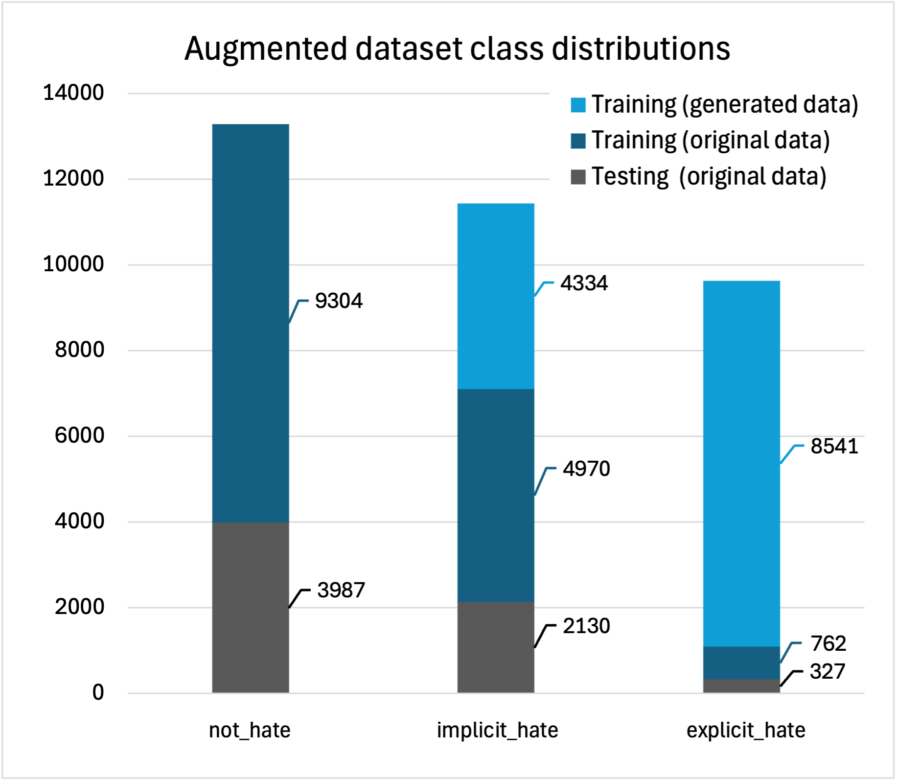
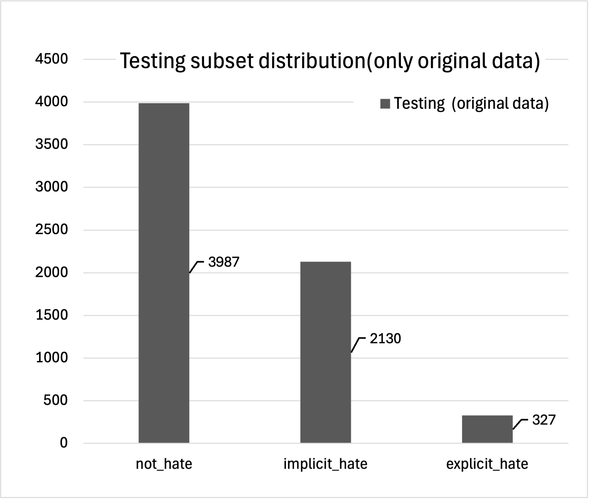

# Implicit and Explicit Hate Speech Detection with HateBERT
This project was made by the group 21 of the EPFL Deep Learning course given by Cavallaro Andrea during the 2025 fall semester.

Group 21 members:
- Jeremy Serillon
- Océane Voland
- Thomas Cirillo

This repository implements a deep learning pipeline to detect and classify hate speech—both **implicit** and **explicit**—using a fine-tuned [HateBERT](https://aclanthology.org/2021.woah-1.1) model on the **Latent Hatred** benchmark dataset from the paper [Latent Hatred: A Benchmark for Understanding Implicit Hate Speech](https://aclanthology.org/2021.emnlp-main.29/).

---

## Table of Contents

- [Project Overview](#project-overview)  
- [Features](#features)  
- [Dataset](#dataset)  
- [Project Structure](#project-structure)  
- [Requirements](#requirements)  
- [Installation](#installation)  
- [Data Preparation](#data-preparation)  
- [Usage](#usage)  
  - [Training](#training)  
  - [Evaluation / Testing](#evaluation--testing)  
- [Results](#results)  
- [Report & Poster](#report--poster)  
- [References](#references)  
- [License](#license)  
- [Contributing](#contributing)  

---

## Project Overview

Many automated systems struggle to detect **implicit hate speech**, where hateful intent is hidden behind figurative language, irony, or stereotypes. This project:

1. **Fine-tunes** a domain-specific transformer model (HateBERT)  
2. Tackles **binary** (not_hate vs. implicit_hate) and **multi-class** (not_hate, implicit_hate, explicit_hate) classification  
3. Explores **regularization** (dropout, weight decay, gradient clipping, cosine scheduler)  
4. Experiments with **data augmentation** via GPT-3 to address class imbalance  

---

## Features

- Leverages the pre-trained **HateBERT** transformer  
- Modular data pipeline with PyTorch `Dataset` and `DataLoader`  
- Configurable hyperparameters (learning rate, batch size, epochs, dropout)  
- Automatic logging of training & testing metrics to `results/`  
- Plots training curves (loss, precision, recall, accuracy and F1-score)
- Support for k-fold cross-validation  

---

## Dataset

### Original dataset

We use the **Stage-1** split of the [Latent Hatred implicit hate corpus](https://github.com/SALT-NLP/implicit-hate):

- **File:** `implicit_hate_v1_stg1.tsv`  
- **Columns:**  
  - `post` (full tweet text)  
  - `class` ∈ {`explicit_hate`, `implicit_hate`, `not_hate`}  

> **Note:** Many tweets in the original corpus are no longer accessible; the provided stage-1 TSV includes full text only.

This original dataset contained the following distribution of class labels: 13'291 `not_hate`, 7'100 `implicit_hate` and 1'089 `explicit_hate`.

### Augmented dataset

To counter these unbalanced distributions, we generated with an LLM model (ChatGPT-o3) by adding 6'192 `implicit_hate` samples and 12'203 `explicit_hate` samples that can be seen in the `generated_implicit_explicit_hate.tsv` file or, respectively, in the `generated_implicit_ONLY.tsv` and `generated_explicit_ONLY.tsv` files.

But in our implementation we did not use all of these generated datas. Here is the maths on how we determined the number of generated data to use while keeping a 60% ratio for training, 20% for validation and 20% for testing.

We selected a 30% pre-testing-ratio which, when multiplied by the number in each class, gives the following testing subset: 3'987 `not_hate`, 2'130 `implicit_hate` and 327 `explicit_hate`. From these we added as much generated samples needed to reach back the targeted 60-to-20-to-20 ratio. By running the maths we get that we need:
0 generated `not_hate`, 4'334 generated `implicit_hate` and 8'541 generated `explicit_hate`.

This allows us to keep only original data for our testing and to have a balanced dataset for training. Below are three plots that illustrate our augmented dataset class distribution:





---

## Project Structure

```
.
├── data/
│   ├── implicit-hate-corpus/
│   │   ├── final-augmentation-sets/
│   │   │   ├── FINAL_TESTING_SET.tsv
│   │   │   └── FINAL_TRAINING_SET.tsv
│   │   ├── implicit_hate_v1_stg1.tsv
│   │   ├── generated_implicit_ONLY.tsv
│   │   ├── generated_explicit_ONLY.tsv
│   │   └── generated_implicit_explicit_hate.tsv
│   └── implicit_hate_corpus_paper.pdf
├── results/
│   ├── results_<timestamp>/
│   │   ├── inference_results_<timestamp>.txt
│   │   ├── testing_results_<timestamp>.txt
│   │   ├── training_plot_<timestamp>.png
│   └── results.csv
│
├── ee559_docker_env/
│   ├── Dockerfile
│   └── requirements.txt
├── tutorials/
│   ├── HowTo_Job_RunAI.md
│   ├── Models-tutorial.md
│   ├── runtest.sh
│   └── cluster_access_tutorial/
│       ├── Cluster access tutorial.pdf
│       └── Cluster acess slides.pdf
│
├── main.py
├── dataset_csv_generation.py
├── poster-group-21.pdf
├── report-group-21.pdf
└── README.md
 
```

- **`data/`** – contains all the datasets with augmented data by ChatGPT
- **`results/`** – generated training/testing logs & figures  
- **`main.py`** – end-to-end training, validation, and testing  
- **`report-group-21.pdf`** & **`poster-group-21.pdf`** – project write-ups  
- **`README.md`** - project documentation

---

## Project requirements 

* **Python 3.8+**
* **PyTorch**
* **Hugging Face** `transformers`
* **scikit-learn**, **pandas**, **numpy**, **matplotlib**, **tqdm**

---

## Installation

To install and run the code, follow the instructions of the `Cluster access tutorial.pdf` file.

---

## Usage

### Training

By default, `main.py` will:

- Read data from `implicit-hate-corpus/final-augmentation-sets/`: `FINAL_TESTING_SET.tsv` & `FINAL_TRAINING_SET.tsv`
  or from: `implicit-hate-corpus/`: `implicit_hate_v1_stg1_posts.tsv` depending on the `SEPERATED_DATASET` value
- Split dataset into train/validation/testing (60/20/20)  
- Fine-tune HateBERT with specified hyperparameters
- Log training loss/accuracy and save plots to `results_<timestamp>/`

Run:
```bash
python main.py
```

### Evaluation / Testing

After training, `main.py` directly evaluates with the testing set and also conducts an inference test that can be modified by hand at the end of the code.

Test metrics and classification reports are saved to `results/testing_results_<timestamp>.txt`.

---

## Results

- **Binary task** without augmentation:  
  - Precision: ~73.3%   
  - Recall: ~74.3%  
  - Accuracy: ~75.5%  
  - F1-score: ~73.6%  
- **Binary task** with synthetic data:  
  - Precision: ~72.2%   
  - Recall: ~74.3%  
  - Accuracy: ~73.3%  
  - F1-score: ~72.6%  
- **Multi-class task** without augmentation:  
  - Precision: ~63.3%   
  - Recall: ~58.9%  
  - Accuracy: ~72.3%  
  - F1-score: ~60.1%  
- **Multi-class task** with synthetic data:  
  - Precision: ~59.1%   
  - Recall: ~59.3%  
  - Accuracy: ~70.0%  
  - F1-score: ~58.7% 

Detailed numbers and plots are in the `poster-group-21.pdf` file or in the `report-group-21.pdf` file for more details.

---

## Report & Poster

For more details and documentation about the underlying theory, please refer to the following documents:
- **Report:** `report-group-21.pdf`  
- **Poster:** `poster-group-21.pdf`  

---

## References

1. ElSherief et al. “Latent Hatred: A Benchmark for Understanding Implicit Hate Speech,” *EMNLP 2021*.  
2. Caselli, Basile, Mitrović & Granitzer. “HateBERT: Retraining BERT for abusive language detection in English,” *WOAH 2021*. 

---

## License

This project is released under the **CC-BY License** <span style="color:red"> ... je suis pas sur de ça: </span> [différent types de license](https://www.epfl.ch/education/educational-initiatives/cede/open-and-accessible-education/selecting-the-appropriate-licence/)

---

